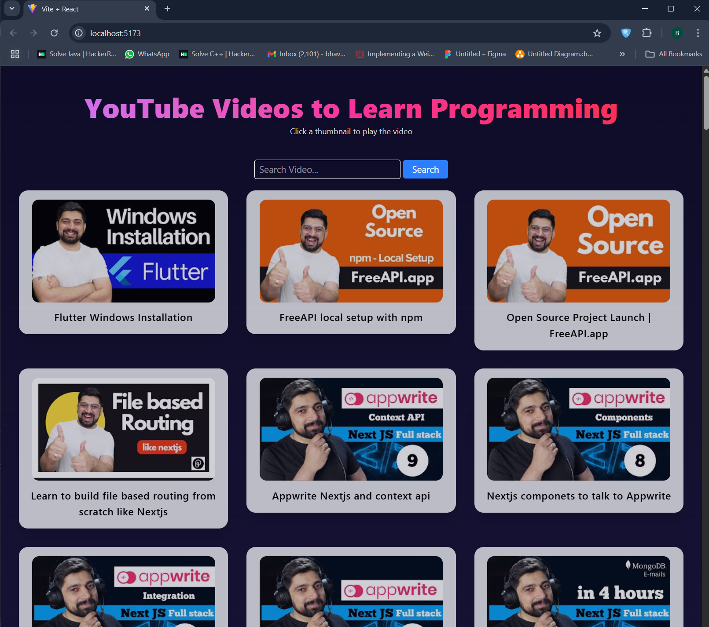

# 🎥 YouTubeApi App

A React-based video app that fetches and plays videos from [freeapi.app](https://freeapi.app), featuring tech educator Hitesh Choudhary. Users can search, browse, and watch videos with a smooth and minimal UI.

## 🚀 Features

- 🔍 **Search Videos** – Quickly find videos by title or keywords.
- ▶️ **Video Playback** – Watch videos directly using the `react-youtube` package.
- 🧭 **Dynamic Routing** – Each video has a dedicated page using `react-router-dom`.
- 🧠 **Redux Toolkit** – Efficient and scalable state management.
- 📦 **API Integration** – Pulls videos from [freeapi.app](https://freeapi.app).
- 📱 **Responsive Design** – Looks great on all screen sizes.

## 🖼️ Demo




## 🧰 Tech Stack

| Tool           | Usage                        |
|----------------|------------------------------|
| React          | Frontend Framework           |
| Redux Toolkit  | State Management             |
| React Router   | Client-side Routing          |
| React YouTube  | Embedded YouTube Player      |
| Tailwind CSS (optional) | UI Styling          |
| freeapi.app    | Video API Source             |

## 📦 Installation

```bash
git clone https://github.com/jbhavyadeep/youTubeApi.git
cd youTubeApi
npm install
npm run dev
